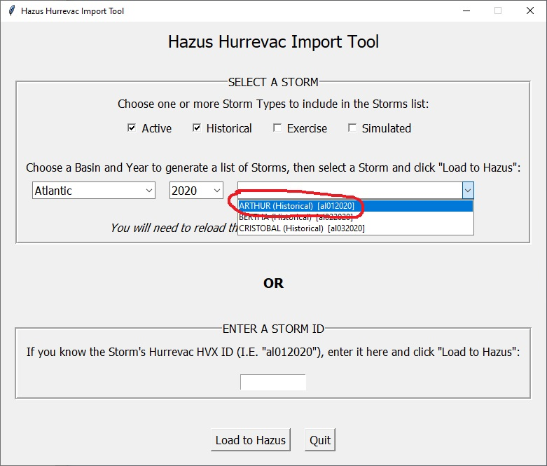
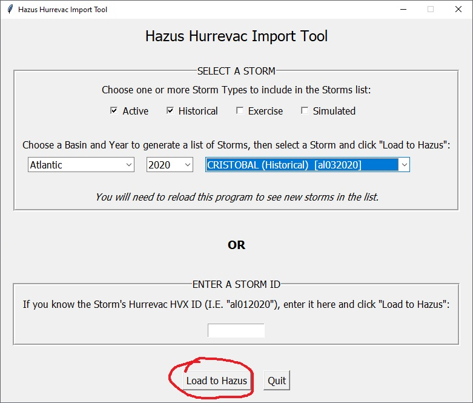

# Hazus Hurrevac Import Tool (HHIT)
The Hazus Hurrevac Import Tool is a tool to download individual Hurrevac Storm data, process and load into your Hazus database to be used as Hurricane scenarios. Launch the tool by double-clicking the "hazus-hurrevac-import-tool.py" file in the download folder.

The HITT is developed using the Hazus Python Package, HazPy. HazPy tools automatically check for updates each time they are opened. Hazus Python Package documentation is found here: https://github.com/nhrap-hazus/hazus

## To Use

**Must have Anaconda 3.X installed. Please read requirements**

1. Download zip folder of tool from GitHub, unzip

 

2. Double-click "hazus-hurrevac-import-tool.py". If you don't have the Hazus Python Library installed, follow the prompt to install, then double-click "hazus-hurrevac-import-tool.py" again. If you have an older version of the HITT tool, follow the prompt to install, then double-click "hazus-hurrevac-import-tool.py" again

 

3. Select a combination of storm type, basin and year to see a list of available storms. Select the storm from the drop down list.

 

4. Alternatively if you know the Hurrevac storm id, enter it in the entry box.

5. Click the 'Load to Hazus' button to load your selected storm from the list or your entered storm id to your Hazus database.

## Requirements

The Hazus Export tool requires Hazus, ArcGIS Desktop, and Anaconda to be installed on your computer and an active internet connection. Anaconda is a free software that automatically manages all Python packages required to run Hazus open source tools - including the Hazus Python package: https://fema-nhrap.s3.amazonaws.com/Hazus/Python/build/html/index.html

1. Go to https://www.anaconda.com/distribution/

2. Download Anaconda for Python 3

3. Complete the installation. During installation, make sure the following options are checked:
   - [x] **Add Anaconda to my PATH environment variable**
   - [x] Register Anaconda as my default Python

## Documentation

## Contact

Issues can be reported through the repository on Github (https://github.com/nhrap-dev/Hurrevac)

For questions contact hazus-support@riskmapcds.com
